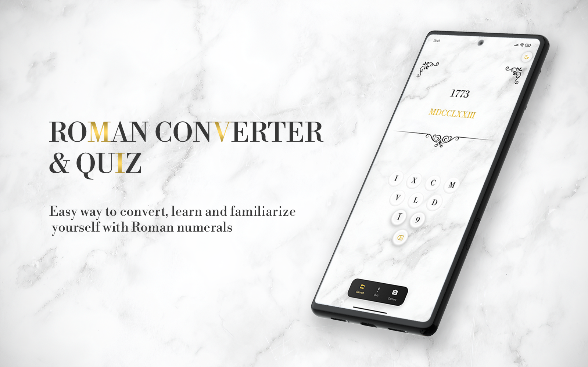
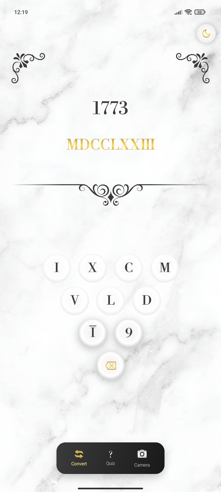
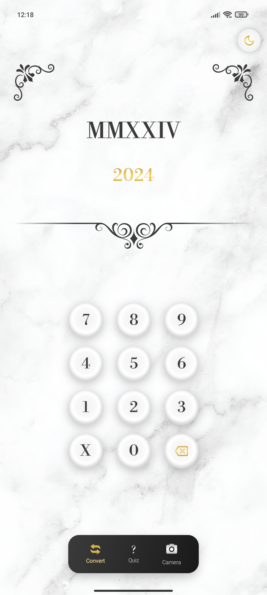
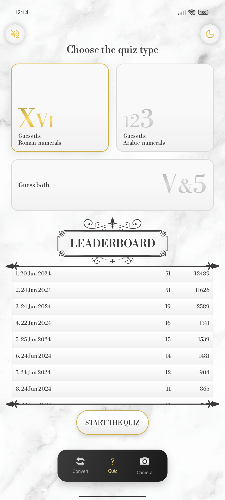
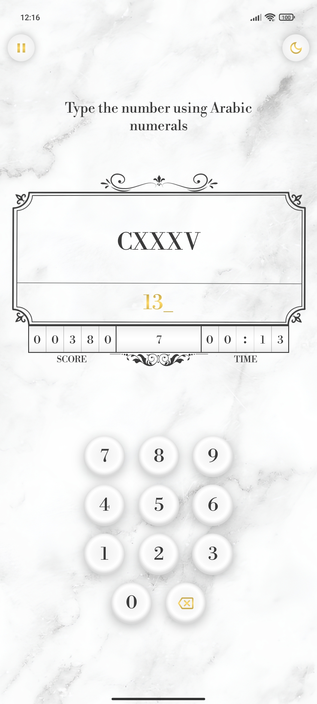
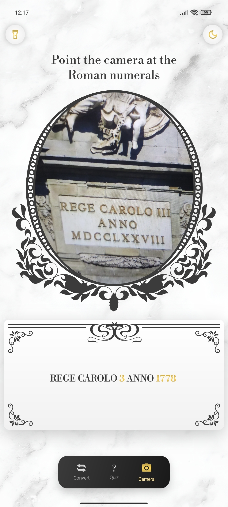
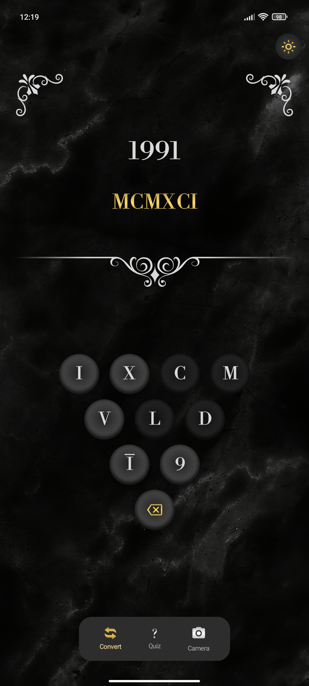

# Roman Numeral Converter & Quiz
An app to easily convert, learn, and familiarize yourself with Roman numerals

[](LICENSE)

## Features
- Effortlessly convert Roman numerals to Arabic ones and vice versa, supporting values up to 3 999 999.
- Quiz mini-game, ability to guess Roman or Arabic numerals in a given time.   
- Leaderboard with previous scores.
- Camera recognition and real-time conversion of Roman numerals.
- Dark mode support.

## Overview
### Converter screen
 


### Quiz screen
 


### Camera screen



### Dark mode



## Technologies used to make an app
- [Kotlin](https://kotlinlang.org/)
- MVVM Architecture pattern
- [Realm](https://github.com/realm/realm-java) local database
- [Dagger-hilt](https://dagger.dev/hilt/) for dependency injection
- [Jetpack Compose](https://developer.android.com/jetpack/compose) for the UI
- [Compose Navigation](https://developer.android.com/jetpack/compose/navigation)
- [Accompanist libraries](https://google.github.io/accompanist/) for easier permission handling in Jetpack Compose
- [Cloudy by skydoves](https://github.com/skydoves/Cloudy) library for easy blur in Jetpack Compose
- [Data store](https://developer.android.com/topic/libraries/architecture/datastore) for saving preferences
- [СameraX](https://developer.android.com/media/camera/camerax) for camera access
- [ML Kit](https://developers.google.com/ml-kit/vision/text-recognition/v2) for text recognition
- [AdMob](https://admob.google.com/intl/en/home/) for mobile ads

## License
```
MIT License

Copyright (c) 2024 Bohdan Deryha

Permission is hereby granted, free of charge, to any person obtaining a copy
of this software and associated documentation files (the "Software"), to deal
in the Software without restriction, including without limitation the rights
to use, copy, modify, merge, publish, distribute, sublicense, and/or sell
copies of the Software, and to permit persons to whom the Software is
furnished to do so, subject to the following conditions:

The above copyright notice and this permission notice shall be included in all
copies or substantial portions of the Software.

THE SOFTWARE IS PROVIDED "AS IS", WITHOUT WARRANTY OF ANY KIND, EXPRESS OR
IMPLIED, INCLUDING BUT NOT LIMITED TO THE WARRANTIES OF MERCHANTABILITY,
FITNESS FOR A PARTICULAR PURPOSE AND NONINFRINGEMENT. IN NO EVENT SHALL THE
AUTHORS OR COPYRIGHT HOLDERS BE LIABLE FOR ANY CLAIM, DAMAGES OR OTHER
LIABILITY, WHETHER IN AN ACTION OF CONTRACT, TORT OR OTHERWISE, ARISING FROM,
OUT OF OR IN CONNECTION WITH THE SOFTWARE OR THE USE OR OTHER DEALINGS IN THE
SOFTWARE.


```
